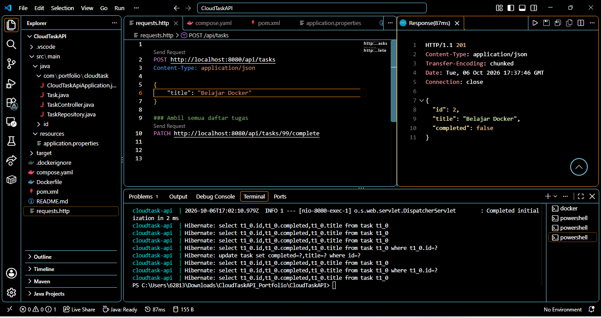
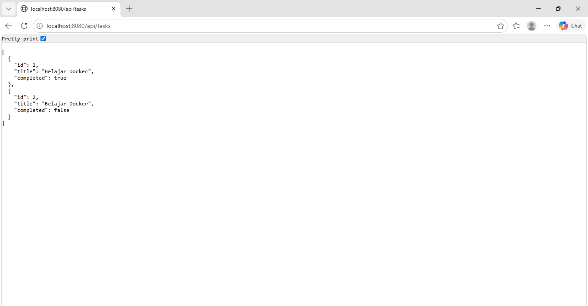
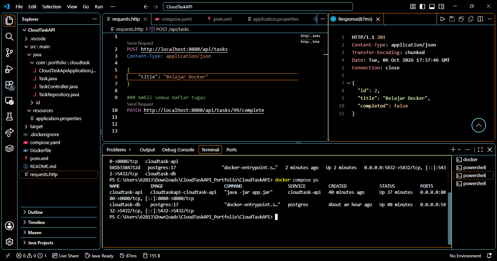
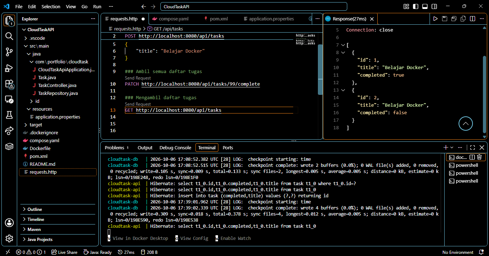

# CloudTask API

CloudTask API adalah aplikasi backend sederhana untuk mengelola daftar tugas menggunakan REST API. Project ini dibuat sebagai sarana belajar pengembangan backend, integrasi database, dan penggunaan container untuk menjalankan aplikasi.

Aplikasi memungkinkan pengguna menambahkan tugas, melihat daftar tugas, dan mengubah status tugas menjadi selesai. Data tugas disimpan menggunakan PostgreSQL supaya tidak hanya bergantung pada memori aplikasi.

## 1. Tujuan Project

Project ini bertujuan untuk mempelajari:

- Cara kerja REST API dalam menerima dan mengembalikan data.
- Pengembangan backend menggunakan Java dan Spring Boot.
- Integrasi aplikasi dengan PostgreSQL.
- Penyimpanan data menggunakan database relasional.
- Penggunaan Docker untuk menjalankan aplikasi dalam container.
- Penggunaan Docker Compose untuk mengelola beberapa layanan dalam satu project.
- Pengujian endpoint API dan penanganan input yang tidak valid.

## 2. Fitur Aplikasi

- **Melihat daftar tugas:** Mengambil seluruh tugas yang tersimpan di database.
- **Menambahkan tugas:** Membuat tugas baru berdasarkan judul yang dikirim pengguna.
- **Menyelesaikan tugas:** Mengubah status tugas menjadi selesai.
- **Memeriksa kondisi aplikasi:** Menyediakan endpoint health check.
- **Validasi input:** Menolak judul tugas yang kosong atau hanya berisi spasi.
- **Penanganan kesalahan:** Mengembalikan respons yang sesuai ketika ID tugas tidak ditemukan.
- **Persistensi data:** Menyimpan data tugas di PostgreSQL sehingga data tetap tersedia ketika container API dimulai ulang.

## 3. Teknologi yang Digunakan

- **Java:** Bahasa pemrograman untuk mengembangkan aplikasi.
- **Spring Boot:** Framework untuk membangun aplikasi backend dan REST API.
- **Spring Data JPA:** Mempermudah interaksi antara aplikasi Java dan database.
- **PostgreSQL:** Database relasional untuk menyimpan data tugas.
- **Docker:** Menjalankan aplikasi dalam container.
- **Docker Compose:** Mengelola container aplikasi dan database.
- **Maven:** Mengelola dependensi dan proses build aplikasi.
- **Visual Studio Code dan REST Client:** Digunakan untuk mengembangkan dan menguji API.

## 4. Gambaran Arsitektur

CloudTask API terdiri dari dua layanan utama:

1. **CloudTask API:** Menerima request HTTP, memvalidasi input, memproses permintaan, dan berkomunikasi dengan database.
2. **PostgreSQL:** Menyimpan data tugas yang meliputi ID, judul, dan status penyelesaian.

Kedua layanan berjalan dalam container yang dikelola menggunakan Docker Compose. Aplikasi API berkomunikasi dengan PostgreSQL melalui jaringan internal Docker.

Alur komunikasi:

Pengguna → CloudTask API → PostgreSQL

Sebagai contoh, ketika pengguna menambahkan tugas, request dikirim ke API. API memproses permintaan tersebut, menyimpan data ke PostgreSQL, kemudian mengembalikan respons kepada pengguna.

## 5. Daftar Endpoint API

| Metode | Endpoint | Fungsi |
|---|---|---|
| GET | `/health` | Memeriksa kondisi aplikasi |
| GET | `/api/tasks` | Mengambil seluruh daftar tugas |
| POST | `/api/tasks` | Menambahkan tugas baru |
| PATCH | `/api/tasks/{id}/complete` | Mengubah status tugas menjadi selesai |

### Contoh Request: Menambahkan Tugas

```http
POST http://localhost:8080/api/tasks
Content-Type: application/json

{
  "title": "Belajar Docker"
}
```

Contoh respons berhasil:

```json
{
  "id": 1,
  "title": "Belajar Docker",
  "completed": false
}
```

ID dibuat secara otomatis oleh database, sehingga nilainya dapat berbeda.

### Contoh Request: Melihat Daftar Tugas

```http
GET http://localhost:8080/api/tasks
```

Contoh respons:

```json
[
  {
    "id": 1,
    "title": "Belajar Docker",
    "completed": false
  }
]
```

### Contoh Request: Menyelesaikan Tugas

```http
PATCH http://localhost:8080/api/tasks/1/complete
```

Jika berhasil, status tugas dengan ID `1` akan berubah menjadi `true` pada bagian `completed`.

### Contoh Penanganan Kesalahan

- **400 Bad Request:** Dikembalikan ketika judul tugas kosong atau hanya berisi spasi.
- **404 Not Found:** Dikembalikan ketika ID tugas yang ingin diselesaikan tidak ditemukan.

## 6. Struktur Project

```text
CloudTaskAPI/
├── src/
│   └── main/
│       ├── java/
│       │   └── com/portfolio/cloudtask/
│       │       ├── CloudTaskApiApplication.java
│       │       ├── Task.java
│       │       ├── TaskController.java
│       │       └── TaskRepository.java
│       └── resources/
│           └── application.properties
├── .dockerignore
├── Dockerfile
├── compose.yaml
├── pom.xml
├── requests.http
└── README.md
```

## 7. Cara Menjalankan Aplikasi

### Persyaratan

Pastikan perangkat sudah memiliki:

- Docker Desktop.
- Editor kode, seperti Visual Studio Code.

Docker Desktop harus dijalankan sebelum memulai aplikasi.

### Langkah Menjalankan

1. Unduh atau clone repositori project ke komputer.
2. Buka folder project di terminal.
3. Jalankan perintah berikut:

```bash
docker compose up --build
```

Docker Compose akan membangun image aplikasi jika diperlukan, kemudian menjalankan container API dan PostgreSQL.

Setelah aplikasi berjalan, endpoint berikut dapat diakses:

- Health check: `http://localhost:8080/health`
- Daftar tugas: `http://localhost:8080/api/tasks`

Untuk melihat status container, buka terminal lain di folder project dan jalankan:

```bash
docker compose ps
```

Untuk menghentikan layanan, tekan `Ctrl + C` pada terminal yang menjalankan aplikasi. Jika container dijalankan di latar belakang menggunakan `-d`, gunakan:

```bash
docker compose down
```

Data PostgreSQL disimpan menggunakan Docker volume yang didefinisikan dalam `compose.yaml`.

## 8. Pengujian

Pengujian dilakukan menggunakan ekstensi REST Client di Visual Studio Code melalui file `requests.http`.

Pengujian yang telah dilakukan meliputi:

- Memeriksa kondisi aplikasi melalui endpoint health check.
- Mengambil daftar tugas menggunakan metode GET.
- Menambahkan tugas menggunakan metode POST.
- Mengubah status tugas menggunakan metode PATCH.
- Memastikan ID yang tidak ditemukan menghasilkan respons 404.
- Memastikan judul yang hanya berisi spasi menghasilkan respons 400.
- Memulai ulang container API dan memeriksa apakah data tugas masih tersedia.
- Memeriksa log aplikasi untuk memastikan koneksi PostgreSQL berhasil dibuat.

Hasil pengujian menunjukkan bahwa fitur utama API dapat digunakan, validasi input berjalan sesuai harapan, dan data tetap tersedia setelah container API dimulai ulang.

## 9. Hal yang Dipelajari

Melalui project ini, saya mempelajari dasar pengembangan REST API menggunakan Java dan Spring Boot, cara menghubungkan aplikasi dengan PostgreSQL menggunakan Spring Data JPA, serta cara menjalankan beberapa layanan menggunakan Docker Compose.

Saya juga mempelajari cara menguji endpoint API, membaca log aplikasi, menangani input yang tidak valid, dan memahami persistensi data pada database.

## Dokumentasi Pengujian

Bagian ini berisi dokumentasi implementasi dan pengujian CloudTask API menggunakan Java, Spring Boot, PostgreSQL, dan Docker.

### 1. Menambahkan Tugas

Pengujian endpoint `POST /api/tasks` untuk menambahkan tugas baru. API mengembalikan respons `201 Created` ketika tugas berhasil dibuat.



### 2. Menampilkan Daftar Tugas

Pengujian endpoint `GET /api/tasks` untuk mengambil dan menampilkan seluruh tugas yang tersimpan dalam database.



### 3. Menjalankan Docker Container

Dokumentasi pemeriksaan container Docker yang menjalankan aplikasi CloudTask API dan database PostgreSQL.



### 4. Memperbarui Status Tugas

Pengujian fitur untuk mengubah status tugas menjadi selesai menggunakan endpoint `PATCH /api/tasks/{id}/complete`.

